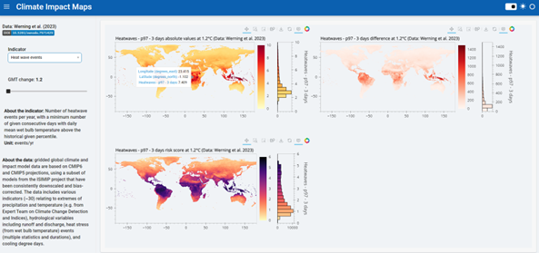

# CSE_dashboards
Exploratory dashboards for gridded data from Werning et al. (2023).

 

Using *Panel, Xarray, hvPlot, Bokeh and Ploomber*.  

View the 👉 [**deployment**](https://cold-voice-5221.ploomberapp.io/app) 👈 (using [Ploomber](https://ploomber.io/)).

